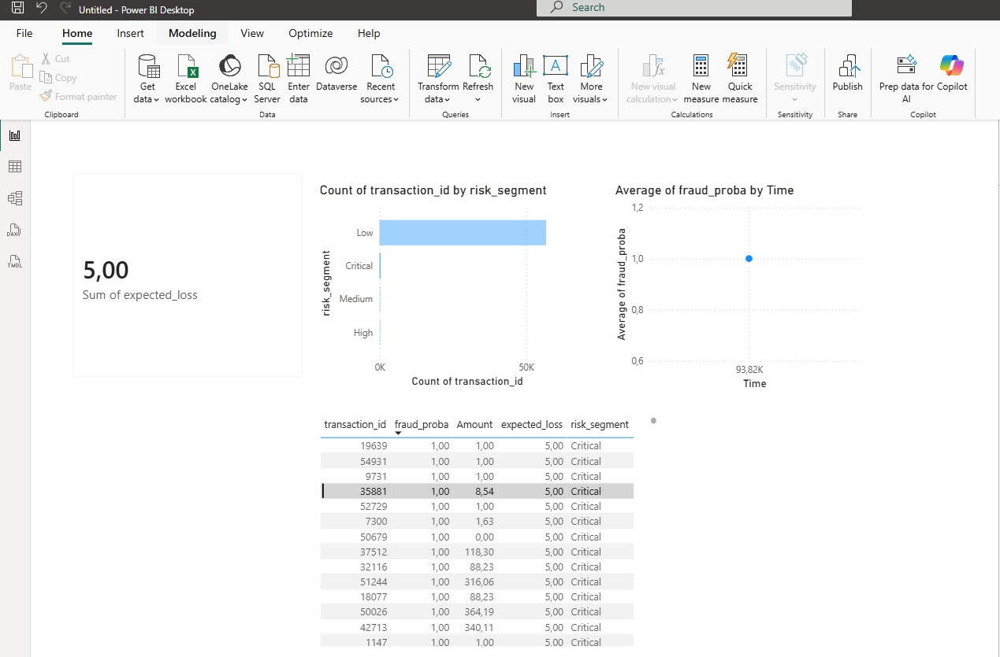

# Fraud Detection ML Project

Machine learning project for fraud detection and financial risk monitoring using Python, SQL-ready datasets, and Power BI.

## Project Goals
Predict fraudulent transactions.  
Estimate expected financial loss.  
Create risk monitoring dashboard in Power BI.

## Dataset
Credit Card Fraud Detection dataset from Kaggle.  
284,807 transactions.  
Severely imbalanced dataset (~0.17% fraud).

Dataset not included in repo due to size.  
Download from Kaggle and place in:

data/raw/creditcard.csv

## Tech Stack
Python  
Scikit-learn  
Pandas / NumPy  
Power BI  
SQL-ready data structure

## ML Pipeline
Data ingestion CSV → Parquet.  
Exploratory Data Analysis (EDA).  
Feature scaling with StandardScaler.  
Logistic Regression baseline model.  
Threshold optimization based on financial loss.  
Risk segmentation for monitoring.

## Model Performance
AUC ≈ 0.96  
Precision ≈ 0.83  
Recall ≈ 0.63  
Optimized threshold ≈ 0.15.

## Business Output
Expected financial loss estimation.  
Risk segmentation (Low, Medium, High, Critical).  
Power BI dashboard for fraud monitoring.

## Dashboard Preview

## Repository Structure
data/ raw datasets (ignored in git)  
notebooks/ EDA and modeling notebooks  
src/ ingestion and processing scripts  
reports/ project documentation  
powerbi/ dashboard files

## Future Improvements
Add tree models RandomForest XGBoost for performance comparison.
Advanced feature engineering based on transaction behavior.
Real time fraud scoring pipeline for production scenario.

## Author
GitHub: vegaFlex
